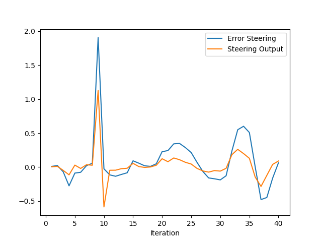
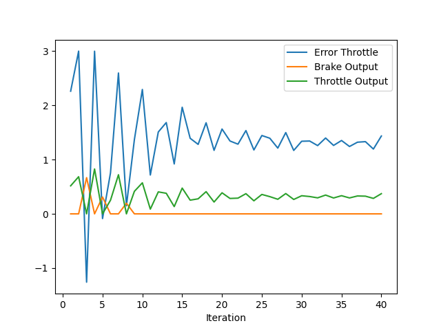

# Control and Trajectory Tracking for Autonomous Vehicle - CARLA


# Proportional-Integral-Derivative (PID)

In this project, you will apply the skills you have acquired in this course to design a PID controller to perform vehicle trajectory tracking. Given a trajectory as an array of locations, and a simulation environment, you will design and code a PID controller and test its efficiency on the CARLA simulator used in the industry.

### Installation

Run the following commands to install the starter code in the Udacity Workspace:

Clone the <a href="https://github.com/udacity/nd013-c6-control-starter/tree/master" target="_blank">repository</a>:

`git clone https://github.com/udacity/nd013-c6-control-starter.git`

## Run Carla Simulator

Open new window

* `su - student`
// Will say permission denied, ignore and continue
* `cd /opt/carla-simulator/`
* `SDL_VIDEODRIVER=offscreen ./CarlaUE4.sh -opengl`

## Compile and Run the Controller

Open new window

* `cd nd013-c6-control-starter/project`
* `./install-ubuntu.sh`
* `cd pid_controller/`
* `rm -rf rpclib`
* `git clone https://github.com/rpclib/rpclib.git`
* `cmake .`
* `make` (This last command compiles your c++ code, run it after every change in your code)

## Testing

To test your installation run the following commands.

* `cd nd013-c6-control-starter/project`
* `./run_main_pid.sh`
This will silently fail `ctrl + C` to stop
* `./run_main_pid.sh` (again)
Go to desktop mode to see CARLA

If error bind is already in use, or address already being used

* `ps -aux | grep carla`
* `kill id`


## Project Instructions

In the previous project you built a path planner for the autonomous vehicle. Now you will build the steer and throttle controller so that the car follows the trajectory.

You will design and run the a PID controller as described in the previous course.

In the directory [/pid_controller](https://github.com/udacity/nd013-c6-control-starter/tree/mathilde/project_c6/project/pid_controller)  you will find the files [pid.cpp](https://github.com/udacity/nd013-c6-control-starter/tree/mathilde/project_c6/project/pid_controller/pid.cpp)  and [pid.h](https://github.com/udacity/nd013-c6-control-starter/tree/mathilde/project_c6/project/pid_controller/pid.h). This is where you will code your pid controller.
The function pid is called in [main.cpp](https://github.com/udacity/nd013-c6-control-starter/tree/mathilde/project_c6/project/pid_controller/main.cpp).

### Step 1: Build the PID controller object
Complete the TODO in the [pid_controller.h](https://github.com/udacity/nd013-c6-control-starter/tree/mathilde/project_c6/project/pid_controller/pid_controller.h) and [pid_controller.cpp](https://github.com/udacity/nd013-c6-control-starter/tree/mathilde/project_c6/project/pid_controller/pid_controller.cpp).

Run the simulator and see in the desktop mode the car in the CARLA simulator. Take a screenshot and add it to your report. The car should not move in the simulation.
### Step 2: PID controller for throttle:
1) In [main.cpp](https://github.com/udacity/nd013-c6-control-starter/tree/mathilde/project_c6/project/pid_controller/main.cpp), complete the TODO (step 2) to compute the error for the throttle pid. The error is the speed difference between the actual speed and the desired speed.

Useful variables:
- The last point of **v_points** vector contains the velocity computed by the path planner.
- **velocity** contains the actual velocity.
- The output of the controller should be inside [-1, 1].

2) Comment your code to explain why did you computed the error this way.

3) Tune the parameters of the pid until you get satisfying results (a perfect trajectory is not expected).

### Step 3: PID controller for steer:
1) In [main.cpp](https://github.com/udacity/nd013-c6-control-starter/tree/mathilde/project_c6/project/pid_controller/main.cpp), complete the TODO (step 3) to compute the error for the steer pid. The error is the angle difference between the actual steer and the desired steer to reach the planned position.

Useful variables:
- The variable **y_points** and **x_point** gives the desired trajectory planned by the path_planner.
- **yaw** gives the actual rotational angle of the car.
- The output of the controller should be inside [-1.2, 1.2].
- If needed, the position of the car is stored in the variables **x_position**, **y_position** and **z_position**

2) Comment your code to explain why did you computed the error this way.

3) Tune the parameters of the pid until you get satisfying results (a perfect trajectory is not expected).

### Step 4: Evaluate the PID efficiency
The values of the error and the pid command are saved in thottle_data.txt and steer_data.txt.
Plot the saved values using the command (in nd013-c6-control-refresh/project):

```
python3 plot_pid.py
```

You might need to install a few additional python modules: 

```
pip3 install pandas
pip3 install matplotlib
```


## Answer the following questions:
- Add the plots to your report and explain them (describe what you see)
- What is the effect of the PID according to the plots, how each part of the PID affects the control command?
- How would you design a way to automatically tune the PID parameters?
- PID controller is a model free controller, i.e. it does not use a model of the car. Could you explain the pros and cons of this type of controller?
- (Optional) What would you do to improve the PID controller?


### Tips:

- When you wil be testing your c++ code, restart the Carla simulator to remove the former car from the simulation.
- If the simulation freezes on the desktop mode but is still running on the terminal, close the desktop and restart it.
- When you will be tuning the PID parameters, try between those values:


### Question and Answer
<br> * Provide the plots in the report and explain the plots and describing what is plotted: the variables, the phenomenon shown.
<br> * What is the effect of the PID according to the plots, how each part of the PID affects the control command?
<br> * How would you design a way to automatically tune the PID parameters?
<br> * PID controller is a model free controller, i.e. it does not use a model of the car. Could you explain the pros and cons of this type of controller?
<br> * (Optional) What would you do to improve the PID controller?

###  Provide the plots in the report and explain the plots and describing what is plotted: the variables, the phenomenon shown.
<br> This plot shows the Error steering(blue) and steering output(orange). The PID controller tries to reduce the error. so Initially, you may found some oscillations. but the it becomes smaller and stable after some iterations. 



This plot shows the throttle (green) and brake output(orange) as well as the error throttle(blue). In the initial iterations, there are much oscillations. with intergral item works on compensation of error, it becomes stable and close. Proportional items casues an offset of error. The car run much smoother along the path.




###  What is the effect of the PID according to the plots, how each part of the PID affects the control command?
Kp directly affected the error. High values results in a large change to close to desired path but make the car oscillated much. Low value maybe make the car run smoother but hard to close the track.
Ki means ingegral and it help to reduce the error to zero. It increases with iterations. High value will make the error smaller. when error is stable, ki is needed to delete error.
Kd is necessary for oscillations. This item is produced based on the error gradient not the error itself. so Kd will flatten the error into a horizontal line.

After tuning of each of parameters, the car can pass most of obastacles. but the trajectory is not perfect.so there is still potential to improve the PID controller.

### How would you design a way to automatically tune the PID parameters?
Frankly, it is very hard to tune the PID parameters manually. I put much time on this. To get the better parameters, I have to tune Kp,Ki,Kd one by one and wish to find a good result. But once I frozen, the parameters will not be changed. This is why I cannot find a number to guide the car in reality.so it is necessary to find a solution to tune the parameters automatically and solve problem in different cases.
TWIDDLE alogorithm is good way to automatically tune the PID parameters as I know until now. It can change the parameters for different cases. This is next direction what I need to study.

### PID controller is a model free controller, i.e. it does not use a model of the car. Could you explain the pros and cons of this type of controller?
Pros:
1. Not complex and easy to understand. 
2. Can be applied in many systems of car.e.g EPS.
Cons:
Due to intergra and differential, It is not friendly for non-linear change. Only similar or close to right value. 

### (Optional) What would you do to improve the PID controller?
I would try to use TWIDDLE alogrithem to improve the PID controller.
